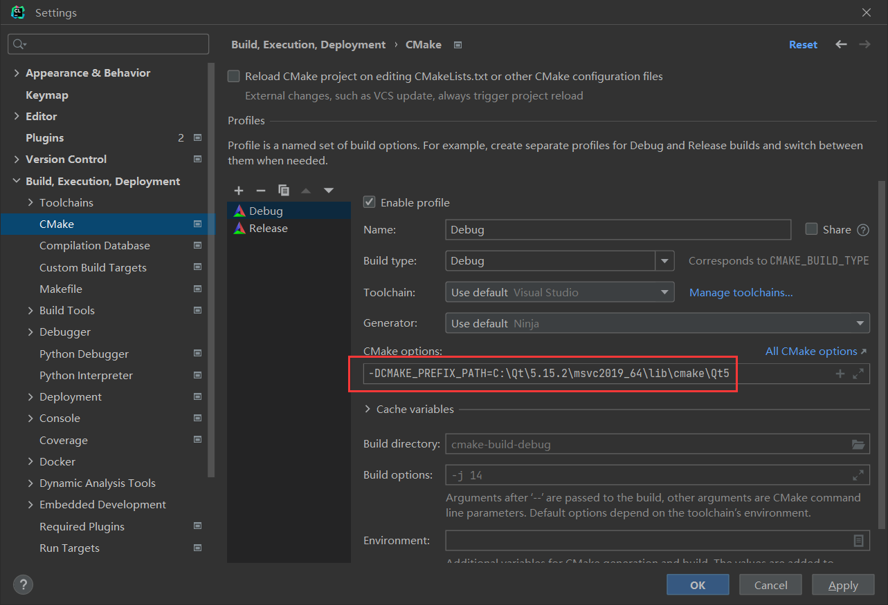

# 准备环境

---

## 安装 Qt

### 在线安装

+ 官方源：https://download.qt.io/official_releases/online_installers

+ 交大源：https://mirror.sjtu.edu.cn/qt/official_releases/online_installers

+ 清华源：https://mirrors.tuna.tsinghua.edu.cn/qt/official_releases/online_installers

+ 阿里云源：https://mirrors.aliyun.com/qt/official_releases/online_installers/

+ 中科大源：https://mirrors.ustc.edu.cn/qtproject/official_releases/online_installers/

### 参考教程

+ https://blog.csdn.net/Qi_1337/article/details/121249717

### 安装选项

+ 版本选择：5.15.2

+ 安装组件：
    + Preview
    + Qt 5.15.2
        + MSVC 2019 32-bit
        + MSVC 2019 64-bit
        + Sources（源码，便于调试与造控件，如果嫌太大可以不要）
        + Qt Debug Information Files（调试文件）
    + Developer and Designer Tools
        + Qt Creator
        + Debugging Tools
        + Qt Creator Debug Symbols
        + Qt Creator Plugin Development
        + Qt Design Studio（设计器，有需要可以下）
        + CMake
        + Ninja
    
    (Mac 编译套件为 Clang，Linux 中为 GCC)
### 注意事项

+ 需要先注册账号，同意所有协议，选择个人开发者
+ Windows/Mac(x86_64)/Linux都需要在这里下载
+ Windows中，建议将Qt库所在目录加入系统 Path

## 安装编译器

### Windows

+ 编译套件： Microsoft VC++ 2019 或更高版本

+ 在Visual Studio Installer中增加`使用C++的桌面开发`模块，添加如下组件。


### MacOS

+ 编译套件：Clang，系统自带

### Linux

+ 编译套件：GCC
```sh
sudo apt install build-essential
```

## IDE

+ Visual Studio（不需要任何配置，但仅支持 Windows）
+ JetBrains Clion（几乎不需要任何配置）
+ Qt Creator（需要初始化编译器和LLVM）
+ VSCode（需要下载CMake、Clangd插件，编写settings.json）

### 注意事项

+ 除了Qt Creator以外，其他所有非官方IDE都无法使用图形界面给工程添加资源条目，因此Qt Creator是必须安装的，在需要改动资源时用QtCreator打开`qrc`文件单独修改

+ 只有Qt Creator和VS支持qmake项目，不过本工程是CMake项目，所以都可以

## 安装其他工具

### LLVM

+ 若使用 QtCreator 开发，需要安装`clang-format`以使用代码格式化
    + https://github.com/llvm/llvm-project/releases

+ 配置Clang-Format
    + 打开Qt Creator
    + 帮助-关于插件-C++
    + 打开Beautifier
    + 重启Qt Creator
    + 工具-选项（或者编辑-首选项）-Beautifier-Clang Format
    + 修改ClangForamtCommand为`LLVM安装路径\bin\clang-format.exe`
        + 如果LLVM安装路径已在系统环境变量中，可直接填`clang-format`
    + 环境-键盘
    + 命令ClangFormat-FormatFile，快捷键自定义，我用的`Ctrl+Alt+L`
    + 确定保存即可


### CMake/Ninja/Clangd

+ 若使用 VSCode 开发，需要安装`clangd`、`cmake`、`ninja`

+ Windows 版本`clangd`在 LLVM 套件中，`cmake`与`ninja`由 Visual Studio 自带

+ MacOS，Linux 中需要自己安装`cmake`与`ninja`
    + 参考以下链接安装`cmake`
    + https://askubuntu.com/questions/355565/how-do-i-install-the-latest-version-of-cmake-from-the-command-line
    + 使用以下命令安装`ninja`与`clangd`
        ```sh
        sudo apt install ninja-build clangd
        ```


### 其他

+ Linux 中其他可能需要的工具
```sh
sudo apt install curl mesa-common-dev libgtk-3-dev libxext-dev libasound2-dev libpulse-dev python3 python3-pip
```

## 可能出现的问题

+ 在 MacOS 平台编译时，如果因为使用`homebrew`安装 Qt 等原因导致产生了诸如`Could not find a package configuration file provided by "Qt5" with any of the following names:...`之类的错误，请在configure前提供如下环境变量以使CMake能找到Qt库的位置（请视情况自行根据安装Qt库的位置改变命令中的路径）：
   ```sh
   export QT_DIR=/opt/homebrew/opt/qt@5
   export Qt5_DIR=/opt/homebrew/opt/qt@5
   ```

## 本工程的配置

### 工程说明

+ 本工程使用CMake构建系统，在Windows上默认使用MSVC 2019 64bit进行开发（如果下载Visual Studio 2022则使用MSVC 2022 64bit），Mac默认使用Clang 64，Linux使用GCC 64。


### 使用vcpkg下载并预构建依赖库

+ 找到Qt安装目录（此目录中包含`Qt5Config.cmake`）
    + Windows中一般是`C:\Qt\5.15.2\msvc2019_64\lib\cmake\Qt5`

+ 如果Qt库没有在系统Path中，那么`cmake`需要添加配置参数`-DCMAKE_PREFIX_PATH=<dir>`，`dir`即为`Qt5Config.cmake`所在目录

<!-- + 告知vcpkg的自定义`triplet`参数
    + 创建`scripts/vcpkg/triplets/paths/path_qt.txt`
    + 直接填入你的Qt安装目录作为仅有的一行（只需要全路径，分隔符可以是反斜杠），之后会由`path_qt.cmake`读取 -->

+ 在仓库根目录执行`python setup-vcpkg.py`
    + 第一次运行必然失败，并生成一个默认配置文件`setup-vcpkg.json`，请在配置文件中所有`value`字段填写`intro`要求的信息，之后重复运行。
    + 此脚本简单地从GitHub中拉取`vcpkg`并执行一系列`vcpkg install`命令。
    + 由于使用 HTTP 协议拉取仓库，国内用户请提前打开代理。

+ 如果CMake版本不低于3.19且`python`在`cmake`能检测到的环境中，那么`cmake`会在配置期先检查`vcpkg`中的库，如果不存在会自动填写`setup-vcpkg.json`并执行`setup-vcpkg.py`（不能存在多个实例同时执行此任务）

<!-- + 可使用`git update-index --no-skip-worktree <file>`在不删除的前提下取消对`path_qt.cmake`的跟踪。 -->

<!-- ### 准备FFmpeg库

+ 下载地址：https://github.com/SineStriker/binary-res
    + 将`bin`、`include`、`lib`、`share`目录直接复制到`pkg/src/FFmpeg/usr`中。
+ 由于需要自己编译FFmpeg，过于复杂建议直接复制粘贴。

### 构建Pre-Built库

+ 在开始菜单搜索`x64 Native Tools Command Prompt for VS 2019`（也可能是2022），它会配置好MSVC编译器的一系列环境变量给此终端上下文。

+ 切换到`pkg`目录
````
cd pkg
````

+ 执行CMake Configure
````
cmake --no-warn-unused-cli -DCMAKE_EXPORT_COMPILE_COMMANDS:BOOL=TRUE -DCMAKE_BUILD_TYPE:STRING=Release -S. -Bbuild -G Ninja
````

+ 执行CMake Build
````
cmake --build build --target all
````

+ 执行CMake Install
````
cmake --build build --target install
````

+ 这些库也可以放在工程里一起参与构建，但是可能会带来不必要的编译任务，所以提前全部编译好。Ninja是用来引入并行化加速构建过程的，因此Build过程可能出错，重新执行Build命令即可。

+ 此外，由于一些库Debug版本与Release版本是不兼容的，还需要构建一份Debug版本的，在CMake Configure中把参数`-DCMAKE_BUILD_TYPE:STRING=Release`改为`-DCMAKE_BUILD_TYPE:STRING=Debug`，然后再次执行三次命令，CMake有热更新机制不用执行Clean。 -->

### 打开工程

#### Qt Creator

+ 直接打开`src/CMakeLists.txt`

#### Visual Studio

+ 直接打开仓库目录，VS会自动检测CMake工程，添加配置可以点击上方`x64-Debug`下拉选择管理配置；


+ 可以为本项目添加x64-Release目标

+ 每次构建建议不要点工具栏单个构建，应该执行`菜单栏-生成-全部生成`。

#### Clion

+ 在 `Settings - Build... - Toolchains` 中将 Visual Studio 设为默认工具链，架构选择 amd64
    
+ 直接打开仓库目录，Clion会自动检测CMake工程
+ 每次构建选择`Build - Build All`，可将`Build All`这个项添加到`Main Toolbar-Toolbar Run Actions`
+ 在 `Settings - Build... - CMake` 中添加`CMAKE_PREFIX_PATH`参数，否则如果未添加 Path 可能找不到 Qt 库
    

#### Visual Studio Code

+ 安装C/C++ Extension Pack（包含CMake）、Clangd扩展


+ 默认重排代码快捷键为`Ctrl+Shift+I(Linux)`/`Alt+Shift+F(Windows)`，可以手动改成JetBrains风格的`Ctrl+Alt+L`；
+ 编辑`.vscode/settings.json`
    ```json
    {
        "cmake.generator": "Ninja",
        "cmake.buildDirectory": "${workspaceFolder}/build/${buildType}",
        "cmake.configureOnOpen": false,
        "cmake.configureOnEdit": false,
        "clangd.arguments": [
            "--header-insertion=never",
            "--function-arg-placeholders=false",
            "--clang-tidy"
        ],
        "C_Cpp.intelliSenseEngine": "Disabled",
        "editor.gotoLocation.alternativeDefinitionCommand": "editor.action.revealDeclaration",
        "cmake.configureSettings": {
            "CMAKE_PREFIX_PATH": "<Qt5Config.cmake所在目录>"
        }
    }
    ```
    + 设定生成器为`Ninja`
    + 设置启动时或改动后不自动执行`CMake Confiugre`
    + 设置Clangd不自动添加头文件，函数不自动填充
    + 关闭`C/C++ IntelliSense`引擎
    + 设置`Ctrl`单击函数时，自动转到声明
    + 设置CMake输出`compile_commands.json`到`build`目录（已注释，Windows似乎不需要）
    + 设置Clangd文件路径（已注释，如果不在系统环境变量中需要启用）

+ `Ctrl+Shift+P`打开命令选择器，下面这些命令很常用
    + `CMake Configure`：配置项目
    + `CMake Build`：构建项目（下方Build按钮也可以）
    + `CMake Clean`：清理项目

+ 直接打开仓库目录，执行`CMake Configure`，编译工具链选择`Visual Studio - amd64`。

### 关于全局环境

+ 如果本地全局环境中安装有其他版本的 Qt 库及其头文件，则必须给CMake添加配置参数`-DCMAKE_PREFIX_PATH=<dir>`，`<dir>`为`setup-vcpkg.json`中已经配置过的路径，确保 CMake 找到正确版本的 Qt。不同 IDE 添加配置参数方法不一。